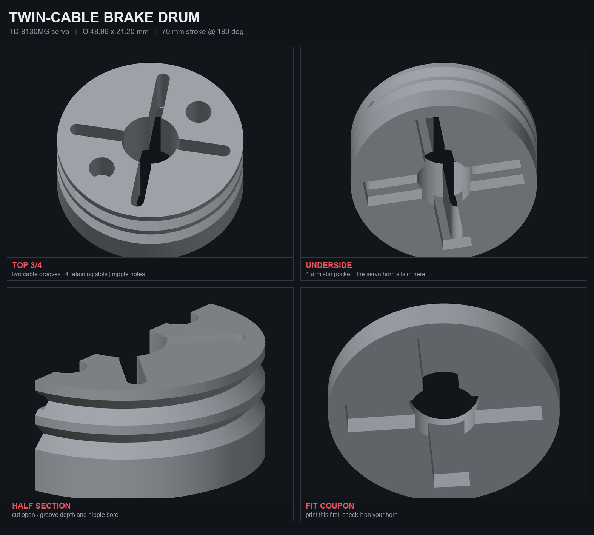
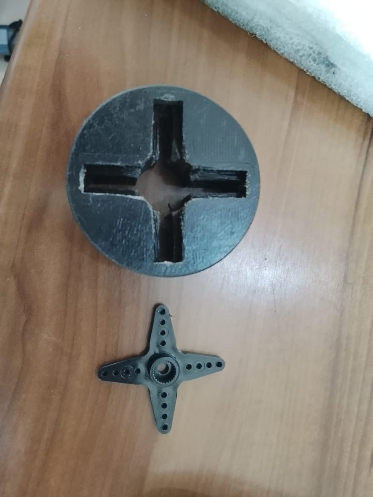
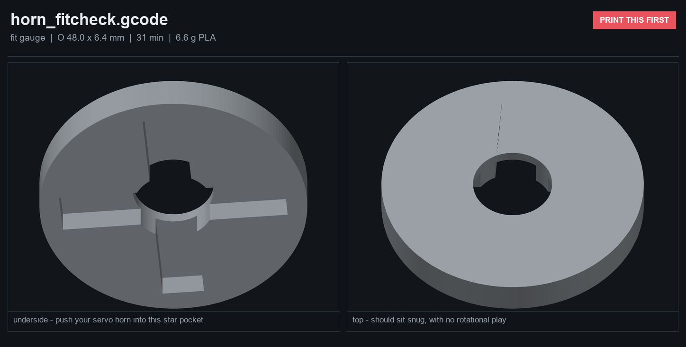
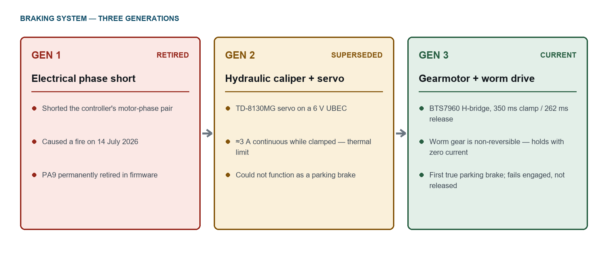
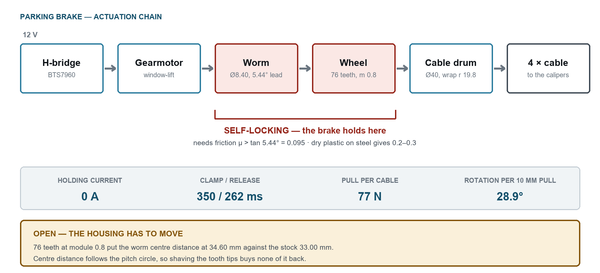

# Fail-Safe Servo Brake Actuator
> A printed drum that lets one servo pull two bicycle brake cables — the mechanical answer to an electrical failure.
`2026` · `OpenSCAD` · `Mechanism design` · `FDM` · `Force analysis`



## About

After the electrical hold-brake failure on SHADOW, the parking brake had to become purely mechanical. This actuator uses a TD-8130MG servo to pull two bicycle brake cables simultaneously through a printed cable drum.

**The key design decision** is that the drum *captures the servo's stock metal horn* rather than reproducing its 25-tooth spline. A 25T spline printed in PLA strips under load — 30 kg·cm across 0.3 mm teeth on a 6 mm shaft is on the order of 100 kg of shear along the layer lines. A captured horn puts the torque into steel and reduces the plastic's job to holding it in place.

**Force analysis drove the geometry, and it has exactly one governing variable.** At a fixed sweep angle the drum diameter follows directly from the cable stroke, and the pull follows inversely from the diameter — so *stroke sets force, and nothing else does*. That makes the honest way to gain force counter-intuitive: shrink the drum. The current design uses a 44 mm stroke on a Ø30.8 drum for about 6.4 kg per cable in normal working conditions, roughly 10.7 kg at stall. An earlier, larger revision with a longer stroke was weaker for the same servo. Going smaller still is not free either — below about Ø28 the cable groove undercuts the very shoulder the cable nipple pulls against, leaving under a millimetre of plastic to carry the load.

**Both cable anchors sit 180° apart and wind the same way,** so the two pulls cancel as a couple instead of summing into a side load on the servo's output bearing. Cable housing stops and mounting blocks were designed alongside the drum — the pull is taken by a tongue bearing against a groove wall rather than by the clamp bolt — and laid out on a single print plate with a fit-test coupon beside the real part, so one print answers both questions.

**The slicer caught what the CAD did not.** Square cable grooves left the flange above them hanging as an unsupported ring, so they became 90° V-sheaves that self-support — and, as a bonus, seat the cable at exactly the design radius automatically. A second finding is worth keeping: the CAD kernel reported the solid as clean while the exported mesh carried ten non-manifold edges, because a derived dimension landed exactly on another feature's rim. **A kernel saying "simple: yes" does not mean the exported file is sound** — the STL itself has to be checked, which is why every part here goes through an STL sanity script and a G-code verification pass before it reaches the printer.

## Figures









## Contents

```
design/
docs/
print/
worm-wheel/
```

## Notes

Not included in this repository: 18 generated/binary file(s), 10 mesh/binary over 2 MB file(s) - build caches, generated toolpaths and oversized binaries are kept out on purpose. The source they are generated from is here.

## Third-party work used here

Everything in this repository is my own work. It builds on the following, which are **not** mine and are used under their own licences:

- **OpenSCAD** by OpenSCAD project — <https://openscad.org>

## Author

Lassaad Mahmoudi — <contact@iris-systems.tn>  
https://linkedin.com/in/mahmoudiassaad
